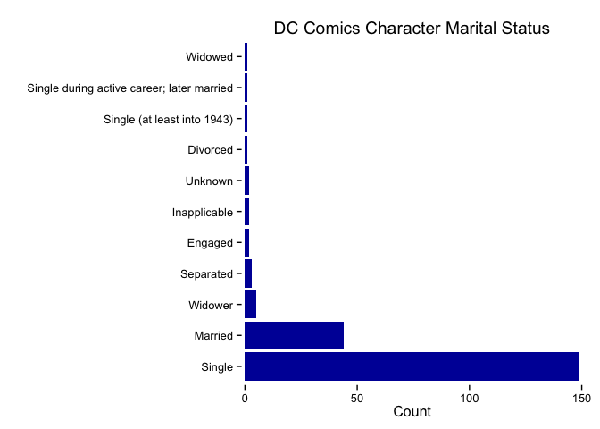

`dcindex` is code to scrape (and scraped data) from [Mike's Amazing World of DC Comics](http://www.dcindexes.com/features/indexes.php?selection=2)

It needs:

-   [rvest](https://github.com/hadley/rvest)
-   [pbapply](http://cran.r-project.org/web/packages/pbapply/index.html)
-   [data.table](http://cran.r-project.org/web/packages/data.table/index.html)

and, all their dependencies.

Heavily commented code == sparse `README`.

``` r
library(data.table)
library(ggplot2)

load("data/dc.rda")

str(dc)
```

    ## Classes 'data.table' and 'data.frame':   325 obs. of  12 variables:
    ##  $ Name              : chr  "Superman (Earth-1)" "Superman (Earth-2)" "Slam Bradley (Earth-1)" "Doctor Occult (Earth-2)" ...
    ##  $ Alter Ego         : chr  "Clark Kent" "Clark Kent" "None" "Unknown" ...
    ##  $ Occupation        : chr  "Newspaper Reporter" "Newspaper Reporter, later Editor" "Private Investigator" "Private Investigator" ...
    ##  $ Marital Status    : chr  "Single" "Married" "Single" "Single" ...
    ##  $ Known Relatives   : chr  "Jor-El (father, deceased), Lara (mother, deceased), Kara Zor-El (cousin, deceased), Zor-El (uncle), Allura (aunt), Jonathan and"| __truncated__ "Jor-L (father, deceased), Lora (mother, deceased), Jon Kent (adoptive father, deceased), Mary Kent (adoptive mother, deceased),"| __truncated__ "None" "None" ...
    ##  $ Group Affiliation : chr  "Justice League of America" "All-Star Squadron, Justice Society of America" "None" "None" ...
    ##  $ Base of Operations: chr  "Metropolis" "Metropolis" "Cleveland, Ohio, later New York City" "An unidentified American city" ...
    ##  $ Height            : chr  "6 ft. 3 in." "6 ft. 2 in." "6 ft." "6 ft. 1 in." ...
    ##  $ Weight            : chr  "225 lbs." "222 lbs." "182 lbs." "189 lbs." ...
    ##  $ Hair              : chr  "Black" "Black" "Black" "Black" ...
    ##  $ Eyes              : chr  "Blue" "Blue" "Blue" "Gray" ...
    ##  $ First Appearance  : chr  "Superman #46" "Action Comics #1" "Detective Comics #1" "New Fun #6" ...
    ##  - attr(*, ".internal.selfref")=<externalptr>

``` r
head(dc$Name)
```

    ## [1] "Superman (Earth-1)"      "Superman (Earth-2)"     
    ## [3] "Slam Bradley (Earth-1)"  "Doctor Occult (Earth-2)"
    ## [5] "Batman (Earth-2)"        "Flash (Earth-2)"

``` r
tmp <- data.frame(table(dc$`Marital Status`))
gg <- ggplot(tmp, aes(x=reorder(Var1, -Freq), y=Freq))
gg <- gg + geom_bar(stat="identity", fill="#0306A6") # superman blue
gg <- gg + scale_y_continuous(expand=c(0.01,0))
gg <- gg + labs(x="", y="Count", title="DC Comics Character Marital Status")
gg <- gg + coord_flip()
gg <- gg + theme_bw()
gg <- gg + theme(panel.grid=element_blank())
gg <- gg + theme(panel.border=element_blank())
gg 
```


